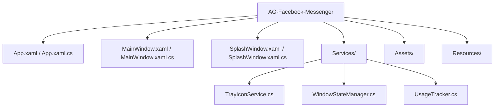

# Architecture Documentation

## Overview
AG-Messenger is a desktop application wrapper for Facebook Messenger, built using **.NET 8 (WPF)** and **Microsoft WebView2**. It replaces the legacy Electron implementation to provide better performance, native Windows integration, and reduced resource usage.

## Technology Stack
- **Framework:** .NET 8.0 (Windows Desktop)
- **UI Framework:** WPF (Windows Presentation Foundation)
- **Browser Engine:** Microsoft Edge WebView2 (Chromium-based)
- **Language:** C# 12.0
- **System Integration:** `Hardcodet.NotifyIcon.Wpf` for Tray support

## Directory Structure

## Key Components

### 1. MainWindow (WebView2)
The core component hosting the Messenger web interface. 
- **Responsibility:** Loads `https://www.messenger.com/`, handles navigation, and injects custom behaviors (if any).
- **Persistence:** Uses `WindowStateManager` to save/restore window size and position.

### 2. SplashWindow
A native WPF window displayed during application startup.
- **Purpose:** Masks the initialization time of the WebView2 control.
- **Logic:** Displays while the main window is preparing.

### 3. Services
- **TrayIconService:** Manages the system tray icon, context menu, and background operation.
- **UsageTracker:** Tracks application launches and session duration (migrated logic).
- **WindowStateManager:** JSON-based persistence of window coordinates using `System.Text.Json`.

## Data Flow
1. **Startup:** `App.xaml.cs` initializes `TrayIconService` and shows `SplashWindow`.
2. **Initialization:** `MainWindow` is created but hidden. WebView2 initializes.
3. **Transition:** Once WebView2 is ready (or timeout reached), `SplashWindow` closes and `MainWindow` is shown.
4. **Runtime:** User interactions occur within the WebView2 environment (web) or Tray Icon (native).
5. **Shutdown:** Closing the window minimizes to Tray (default) unless "Exit" is chosen from the Tray menu.

## Security & Constraints
- **Allowed Domains:** Navigation is restricted to Messenger/Facebook domains. External links open in the default system browser.
- **WebView2:** Runs in a secure context with isolated user data folder.
